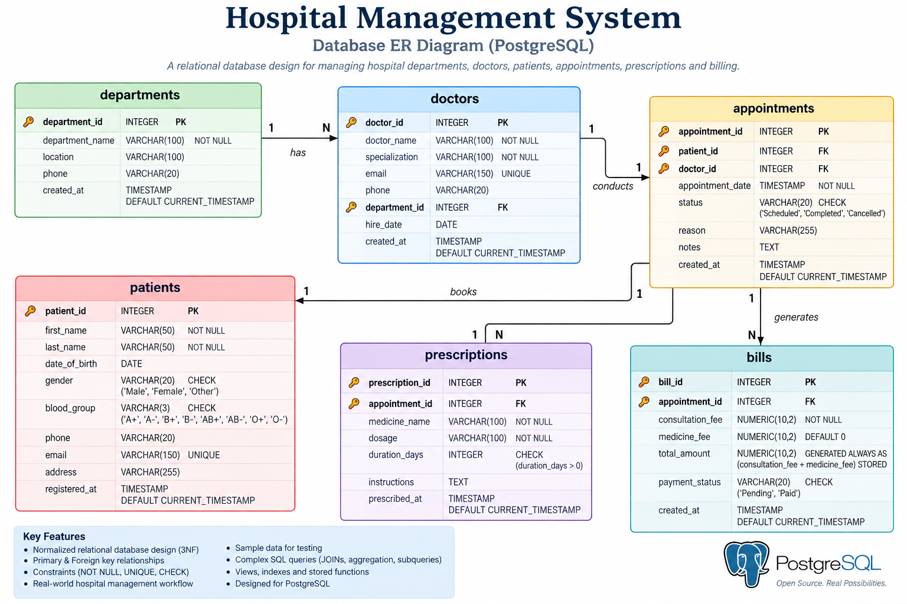

# Hospital Management System — PostgreSQL

A relational database project built with PostgreSQL 17 to demonstrate practical SQL and database-development skills.

## Project Overview

The system models a hospital's core operations:

- Hospital departments
- Doctors and specializations
- Patients
- Appointments
- Prescriptions
- Billing and payment status

The project demonstrates relational database design, constraints, foreign keys, joins, aggregation, views, indexes, generated columns, and PostgreSQL functions.

## Tech Stack

- PostgreSQL 17
- SQL
- pgAdmin 4

## Database Design

### Entity Relationship Diagram



The database follows a relational design connecting departments, doctors, patients, appointments, prescriptions, and billing records through primary and foreign keys.

```text
departments
    │
    └──< doctors
            │
            └──< appointments >── patients
                       │
                       ├──< prescriptions
                       │
                       └──< bills
```

## Repository Structure

```text
hospital-management-postgresql/
├── README.md
├── .gitignore
└── sql/
    ├── 01_schema.sql
    ├── 02_seed_data.sql
    ├── 03_queries.sql
    ├── 04_views.sql
    ├── 05_indexes.sql
    └── 06_functions.sql
```

## Features

### Database Design
- Primary keys using PostgreSQL `GENERATED ALWAYS AS IDENTITY`
- Foreign-key relationships
- `NOT NULL`, `UNIQUE`, and `CHECK` constraints
- Default timestamps
- Generated billing totals using a stored generated column

### SQL Operations
- `INSERT`, `UPDATE`, and `SELECT`
- `INNER JOIN`, `LEFT JOIN`, `RIGHT JOIN`, and `FULL JOIN`
- `GROUP BY`, `HAVING`, and aggregate functions
- Multi-table reporting queries
- Filtering and ordering

### PostgreSQL Features
- Views
- Indexes
- SQL functions
- Generated columns
- Cascading deletes

## Setup

1. Install PostgreSQL 17 and pgAdmin 4.
2. Create the database:

```sql
CREATE DATABASE hospital_management;
```

3. Connect to `hospital_management`.
4. Execute the SQL files in this order:

```text
01_schema.sql
02_seed_data.sql
03_queries.sql
04_views.sql
05_indexes.sql
06_functions.sql
```

The files are intentionally separated so the database can be recreated cleanly without mixing schema definitions, seed data, and analytical queries.

## Example Reporting Query

```sql
SELECT
    a.appointment_id,
    p.first_name || ' ' || p.last_name AS patient_name,
    d.doctor_name,
    dep.department_name,
    a.status,
    b.total_amount,
    b.payment_status
FROM appointments a
JOIN patients p
    ON a.patient_id = p.patient_id
JOIN doctors d
    ON a.doctor_id = d.doctor_id
JOIN departments dep
    ON d.department_id = dep.department_id
LEFT JOIN bills b
    ON a.appointment_id = b.appointment_id
ORDER BY a.appointment_id;
```

## Learning Goals

This project was built to practice the skills expected in SQL/PostgreSQL developer roles:

- Relational modeling
- Referential integrity
- Query writing
- Data aggregation
- Reporting
- Query organization
- Basic performance considerations
- PostgreSQL-specific features

## Author

Mohammed Faiz
